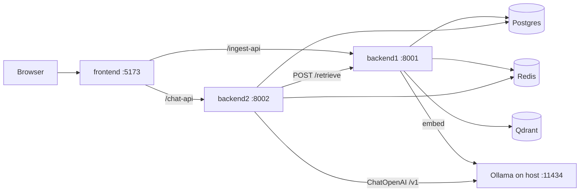

# SDNU Enterprise RAG

中文: [README.md](./README.md)

Multi-tenant RAG demo over a Shandong Normal University (SDNU) knowledge base. Demo tenant: **`sdnu-demo`**. Corpus: `knowledge/sdnu/` (~**16** documents → ~**49** chunks after ingest).

Stack: FastAPI + LangChain, React/Vite/Ant Design, Postgres, Redis, Qdrant, host Ollama. `docker compose up --build` starts the app stack; Ollama stays on the host (not in Compose).

## Tech highlights

| Feature | Detail |
|---------|--------|
| Service split (`backend1` / `backend2`) | `backend1`: ingest + vector retrieval. `backend2`: auth, sessions, RAG chat. Retrieval and generation are separated over HTTP. |
| Multi-tenant `X-Tenant-Id` | Required on protected routes; must match JWT `tenant_id`. Qdrant payloads and Postgres rows are scoped the same way. |
| Retrieval via `backend1` `/retrieve` | Compose sets `RETRIEVAL_BACKEND=backend1`. Chat calls `POST /api/v1/retrieve` instead of opening Qdrant in-process. |
| Shared embedding model | Ollama `qwen3-embedding:0.6b`, **1024-d**, same model for ingest and query embedding. |
| OpenAI-compatible LLM triple + hot config | Runtime `base_url` / `model` / `api_key` via `GET\|PUT /api/v1/llm/config` (defaults to host Ollama). |
| SSE citations | `/api/v1/chat/stream` emits `citation` → `token`* → `done` (or `error`). |
| Redis cache / rate-limit fail-open | Retrieval cache + chat rate limit. If Redis is down, requests are allowed (no 500); over limit → **429**. |
| Docker Compose one-click | Postgres + Redis + Qdrant + `backend1` + `backend2` + frontend; Ollama via `host.docker.internal`. |

## Architecture



## Layout & ports

| Path | Service | Default port |
|------|---------|--------------|
| `backend1/` | Ingest + retrieval (FastAPI / LangChain / Qdrant) | `8001` |
| `backend2/` | Auth / sessions / chat SSE (FastAPI / LangChain LCEL) | `8002` |
| `frontend/` | Docs + chat UI (React / Vite / Ant Design; nginx in Compose) | `5173` |
| `knowledge/sdnu/` | Demo corpus (txt) | — |
| `postgres` / `redis` / `qdrant` | Data plane (Compose) | Qdrant `6333` |

Frontend proxies: `/ingest-api` → `backend1`, `/chat-api` → `backend2` (SSE buffering off in nginx).

## Compose quick start

Prerequisites: Docker Compose, and **Ollama on the host** with both models:

```bash
ollama pull qwen3-embedding:0.6b
ollama pull qwen2.5:1.5b
```

```bash
cp .env.example .env   # set JWT_SECRET (shared by backend1 and backend2)
docker compose up -d --build
```

After a healthy start:

| Surface | URL |
|---------|-----|
| Frontend | http://127.0.0.1:5173 |
| `backend1` OpenAPI | http://127.0.0.1:8001/docs |
| `backend2` OpenAPI | http://127.0.0.1:8002/docs |

Per-service notes: `backend1/COMPOSE.md`, `backend2/COMPOSE.md`, `frontend/COMPOSE.md`.

## First-time ingest (`knowledge/sdnu/`)

Compose mounts `knowledge/sdnu` read-only into `backend1`; it does **not** auto-ingest.

1. Open http://127.0.0.1:5173 and **register** (or login) with tenant **`sdnu-demo`**.
2. On the documents page, upload files from `knowledge/sdnu/` (or call `POST /api/v1/ingest` on `:8001` with `Authorization` + `X-Tenant-Id: sdnu-demo`).
3. Prefer `sync=true` for these small txt files so status becomes ready immediately.

Without ingest, the document list is empty and chat has nothing to retrieve.

## Nested / restricted Docker

On nested Docker or locked-down bridges, default `overlay2` / iptables FORWARD can break inter-container DNS/TCP. If services hang on DB connect:

- Try `storage-driver: vfs` in `/etc/docker/daemon.json`
- Confirm containers can reach each other on the Compose network
- Bind Ollama to **`0.0.0.0:11434`** (not only `127.0.0.1`) so `host.docker.internal` works (`extra_hosts: host.docker.internal:host-gateway` is already set)

## Models & config

| Role | Default | Notes |
|------|---------|--------|
| Embedding | `qwen3-embedding:0.6b` via Ollama | **1024** dims; changing the model requires recreating collection `sdnu_chunks` and re-ingest |
| Chat LLM | `qwen2.5:1.5b` via OpenAI-compatible `/v1` | Root `.env`: `OPENAI_BASE_URL`, `OPENAI_API_KEY`, `OPENAI_MODEL` |
| Hot LLM switch | `backend2` `GET\|PUT /api/v1/llm/config` | Body: `{ "base_url", "model", "api_key?" }` — no restart |
| JWT | `JWT_SECRET` + HS256 | Must match between `backend1` and `backend2` |
| Collection | `sdnu_chunks` | Payload includes `tenant_id` |

Local (no Compose): `backend1` can use SQLite + `QDRANT_PATH`; keep `RETRIEVAL_BACKEND=backend1` on `backend2` so it does not open a conflicting local Qdrant path.

## API sketch

Protected-route headers:

```http
Authorization: Bearer <JWT>
X-Tenant-Id: sdnu-demo
```

**`backend1` (`:8001`)**

| Method | Path | Notes |
|--------|------|--------|
| GET | `/api/v1/health` | Public |
| GET | `/api/v1/documents` | List tenant docs |
| POST | `/api/v1/ingest` | multipart: `file`, `doc_type`, `sync` |
| GET | `/api/v1/ingest/{document_id}` | Job status |
| POST | `/api/v1/retrieve` | `{ "query", "top_k", "doc_type?" }` |

**`backend2` (`:8002`)**

| Method | Path | Notes |
|--------|------|--------|
| POST | `/api/v1/auth/register` · `/login` | Public; returns JWT |
| GET | `/api/v1/auth/me` | Current user |
| GET/POST | `/api/v1/sessions` | List / create |
| GET/DELETE | `/api/v1/sessions/{id}` | Detail / delete |
| POST | `/api/v1/chat` | Sync answer + citations |
| POST | `/api/v1/chat/stream` | SSE: `citation` / `token` / `error` / `done` |
| GET/PUT | `/api/v1/llm/config` | Hot LLM triple |
| GET | `/api/v1/health` | Public; dependency detail |

## FAQ

**Q: Chat has no citations / empty docs?**  
A: Ingest `knowledge/sdnu/` for tenant `sdnu-demo` first. Empty index → empty retrieve.

**Q: `401` / `403` on ingest or chat?**  
A: Missing/invalid Bearer → 401. Missing `X-Tenant-Id` → 400. Header tenant ≠ JWT `tenant_id` → 403. Share one `JWT_SECRET`.

**Q: Embedding / vector dim errors?**  
A: Ingest and query must use the same Ollama embedding model (**1024-d**). After a model change, recreate `sdnu_chunks` and re-ingest.

**Q: Redis red in health — is chat broken?**  
A: No. Cache and rate limit fail open. Over-limit only when Redis works → HTTP 429.

**Q: Containers cannot reach Ollama?**  
A: Listen on `0.0.0.0:11434`, keep `host.docker.internal:host-gateway`, and pull both models on the host.

**Q: Point chat at another OpenAI-compatible API?**  
A: Yes — set Compose / `OPENAI_*`, or use Settings / `PUT /api/v1/llm/config` without rebuild.

## Scope

Demo / portfolio project: public-style SDNU corpus + multi-tenant RAG pipeline. **Not** an official university system.

中文: [README.md](./README.md)
