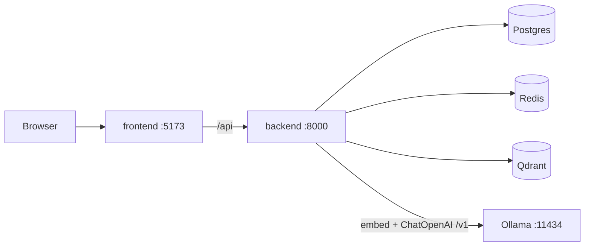

# SDNU Enterprise RAG

中文: [README.md](./README.md)

Multi-tenant RAG: FastAPI + LangChain + Qdrant, SSE citation provenance, same-model Ollama embedding, one-click Compose / `start.sh` demo.

Demo tenant **`sdnu-demo`** · corpus `knowledge/sdnu/` (~**16** documents).

## Tech stack

- **Backend**: FastAPI · LangChain (LCEL) · JWT auth
- **Frontend**: React · Vite · Ant Design
- **Data**: Postgres · Redis · Qdrant (collection `sdnu_chunks`)
- **Models**: Ollama `qwen3-embedding:0.6b` (**1024-d**) · OpenAI-compatible chat (default `qwen2.5:1.5b`)
- **Ops**: Docker Compose · `start.sh` local one-click start

## Highlights

| Capability | Detail |
|------------|--------|
| Ingest & chat | FastAPI `:8000`: `ingest` upload / retrieve, `chat` auth / sessions / RAG; retrieve is in-process |
| Multi-tenant isolation | Protected routes require `X-Tenant-Id` matching JWT `tenant_id`; Qdrant payloads and Postgres rows scoped the same way |
| LangChain RAG | Retrieve → generate with citations; chat side orchestrated with LCEL |
| SSE citation provenance | `/api/v1/chat/stream`: `citation` → `token`* → `done` (or `error`); answers trace back to concrete chunks |
| Same-model embedding | Ingest and query both use Ollama `qwen3-embedding:0.6b`, **1024-d**, no dimension drift |
| Hot-swappable LLM | OpenAI-compatible triple `base_url` / `model` / `api_key` via `GET\|PUT /api/v1/llm/config` — no restart |
| One-click demo | `docker compose up --build` or `./start.sh` (Postgres + Redis + Qdrant + backend + frontend) |
| Ragas eval | `backend/evals` + `pytest tests/test_ragas_sample.py` (offline smoke / optional live Ollama) |
| Rate limit fail-open | Redis chat rate limit (default 60/min); if Redis is down, allow (no 500); over limit → **429** |

## Architecture



## Quick start

Prerequisites: [Ollama](https://ollama.com) on the host, then pull:

```bash
ollama pull qwen3-embedding:0.6b
ollama pull qwen2.5:1.5b
```

**Option A — Compose**

```bash
cp .env.example .env   # set JWT_SECRET
docker compose up -d --build
```

**Option B — local `start.sh`**

```bash
./start.sh          # Postgres + Qdrant (Docker) + host Redis / Ollama + backend + frontend
./start.sh stop
```

| Surface | URL |
|---------|-----|
| Frontend | http://127.0.0.1:5173 |
| backend OpenAPI | http://127.0.0.1:8000/docs |

**First ingest**: `./start.sh` idempotently loads `knowledge/sdnu/` into tenant `sdnu-demo`. Compose does **not** auto-ingest; register/login as `sdnu-demo` and upload on the documents page (prefer `sync=true` for small txts), or call `POST /api/v1/ingest` on `:8000` with `Authorization` + `X-Tenant-Id: sdnu-demo`.

## Ports & key APIs

| Service | Port | Role |
|---------|------|------|
| frontend | `5173` | UI (`/api` → backend) |
| backend | `8000` | `POST /ingest` · `POST /retrieve` · auth · sessions · `POST /chat/stream` · hot LLM config |
| Qdrant | `6333` | Vectors, collection `sdnu_chunks` |

Protected headers: `Authorization: Bearer <JWT>` + `X-Tenant-Id: sdnu-demo`.

## Scope

Portfolio / demo project: public-style SDNU corpus + multi-tenant RAG pipeline. **Not** an official university system. Emblem attribution: [frontend/public/ATTRIBUTION.md](./frontend/public/ATTRIBUTION.md).

中文: [README.md](./README.md)
