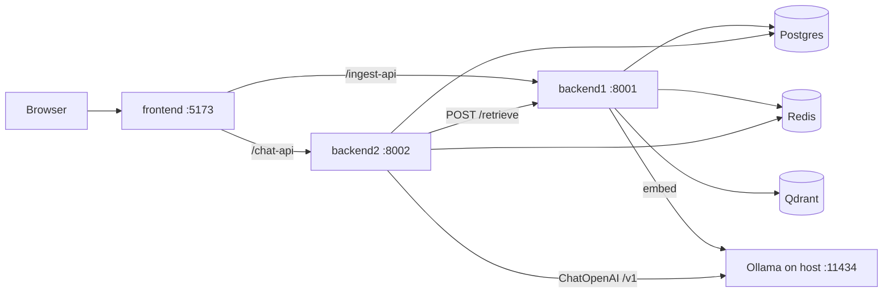

# SDNU Enterprise RAG

English: [README.en.md](./README.en.md)

山东师范大学（SDNU）多租户知识库问答 **RAG 演示**。演示租户：`sdnu-demo`。语料目录 `knowledge/sdnu/`（约 **16** 篇文档，入库后约 **49** 个 chunk）。

技术栈：FastAPI + LangChain、React/Vite/Ant Design、Postgres、Redis、Qdrant、宿主机 Ollama。应用侧 `docker compose up --build` 一键拉起；Ollama 不进 Compose，跑在宿主机。

## 技术亮点

| 能力 | 说明 |
|------|------|
| 服务拆分 `backend1` / `backend2` | `backend1` 负责入库与向量检索；`backend2` 负责鉴权、会话与 RAG 对话。检索与生成经 HTTP 边界解耦。 |
| 多租户 `X-Tenant-Id` | 受保护接口必填，且须与 JWT `tenant_id` 一致；Qdrant payload 与 Postgres 行同样按租户隔离。 |
| 检索走 `backend1` `/retrieve` | Compose 默认 `RETRIEVAL_BACKEND=backend1`；对话侧调用 `POST /api/v1/retrieve`，不强依赖本进程直连 Qdrant。 |
| 统一 Embedding | Ollama `qwen3-embedding:0.6b`，**1024 维**；入库与查询向量使用同一模型。 |
| OpenAI 兼容 LLM 三元组 + 热配置 | 运行时 `base_url` / `model` / `api_key`，经 `GET\|PUT /api/v1/llm/config` 切换（默认指向宿主机 Ollama）。 |
| SSE 引用 | `/api/v1/chat/stream` 事件：`citation` → `token`* → `done`（或 `error`）。 |
| Redis 缓存 / 限流 fail-open | 检索缓存 + chat 限流；Redis 不可达时放行（不 500）；超限 → **429**。 |
| Docker Compose 一键 | Postgres + Redis + Qdrant + `backend1` + `backend2` + frontend；容器经 `host.docker.internal` 访问 Ollama。 |

## 架构



## 目录与端口

| 路径 | 服务 | 默认端口 |
|------|------|----------|
| `backend1/` | 入库 + 检索（FastAPI / LangChain / Qdrant） | `8001` |
| `backend2/` | 鉴权 / 会话 / 对话 SSE（FastAPI / LangChain LCEL） | `8002` |
| `frontend/` | 文档管理 + 对话 UI（React / Vite / Ant Design；Compose 内 nginx） | `5173` |
| `knowledge/sdnu/` | 演示语料（txt） | — |
| `postgres` / `redis` / `qdrant` | 数据面（Compose） | Qdrant `6333` |

前端代理：`/ingest-api` → `backend1`，`/chat-api` → `backend2`（nginx 关闭 SSE buffering）。

## 本机一键启动

```bash
./start.sh          # Postgres + Qdrant + 后端 + 前端
./start.sh stop
```

日志在 `.run/`。Ollama 需已安装并 pull `qwen3-embedding:0.6b`、`qwen2.5:1.5b`。本机已有 Redis 时复用 `:6379`。

## Compose 快速启动

前置：Docker Compose，以及宿主机 **Ollama**（需 pull 两个模型）：

```bash
ollama pull qwen3-embedding:0.6b
ollama pull qwen2.5:1.5b
```

```bash
cp .env.example .env   # 设置 JWT_SECRET（backend1 / backend2 共用）
docker compose up -d --build
```

启动后：

| 入口 | URL |
|------|-----|
| 前端 | http://127.0.0.1:5173 |
| `backend1` OpenAPI | http://127.0.0.1:8001/docs |
| `backend2` OpenAPI | http://127.0.0.1:8002/docs |

各服务 Compose 说明：`backend1/COMPOSE.md`、`backend2/COMPOSE.md`、`frontend/COMPOSE.md`。

## 首次灌库（`knowledge/sdnu/`）

Compose 会把 `knowledge/sdnu` 只读挂进 `backend1`，**不会自动入库**。

1. 打开 http://127.0.0.1:5173，用租户 **`sdnu-demo`** 注册或登录。
2. 在文档页上传 `knowledge/sdnu/` 下文件（或对 `:8001` 调 `POST /api/v1/ingest`，带 `Authorization` + `X-Tenant-Id: sdnu-demo`）。
3. 这些小 txt 建议 `sync=true`，便于立刻看到就绪状态。

未灌库时文档列表为空，问答无检索命中。

## 嵌套 / 受限 Docker

嵌套 Docker 或桥接受限时，默认 `overlay2` / iptables FORWARD 可能导致容器间 DNS/TCP 不通。若卡在连库：

- `/etc/docker/daemon.json` 可尝试 `storage-driver: vfs`
- 确认 Compose 网络内互通
- 让 Ollama 监听 **`0.0.0.0:11434`**（不要只绑 `127.0.0.1`），以便 `host.docker.internal` 可用（已配置 `extra_hosts: host.docker.internal:host-gateway`）

## 模型与配置

| 用途 | 默认 | 说明 |
|------|------|------|
| Embedding | Ollama `qwen3-embedding:0.6b` | **1024** 维；换模型需重建集合 `sdnu_chunks` 并重新入库 |
| 对话 LLM | `qwen2.5:1.5b`（OpenAI 兼容 `/v1`） | 根目录 `.env`：`OPENAI_BASE_URL` / `OPENAI_API_KEY` / `OPENAI_MODEL` |
| LLM 热切换 | `backend2` `GET\|PUT /api/v1/llm/config` | Body：`{ "base_url", "model", "api_key?" }`，无需重启 |
| JWT | `JWT_SECRET` + HS256 | `backend1` 与 `backend2` 必须一致 |
| 向量集合 | `sdnu_chunks` | payload 含 `tenant_id` |

本机无 Compose：`backend1` 可用 SQLite + `QDRANT_PATH`；`backend2` 建议保持 `RETRIEVAL_BACKEND=backend1`，避免两边争用本地 Qdrant 路径。

## API 概要

受保护接口请求头：

```http
Authorization: Bearer <JWT>
X-Tenant-Id: sdnu-demo
```

**`backend1`（`:8001`）**

| Method | Path | 说明 |
|--------|------|------|
| GET | `/api/v1/health` | 公开 |
| GET | `/api/v1/documents` | 租户文档列表 |
| POST | `/api/v1/ingest` | multipart：`file`、`doc_type`、`sync` |
| GET | `/api/v1/ingest/{document_id}` | 入库状态 |
| POST | `/api/v1/retrieve` | `{ "query", "top_k", "doc_type?" }` |

**`backend2`（`:8002`）**

| Method | Path | 说明 |
|--------|------|------|
| POST | `/api/v1/auth/register` · `/login` | 公开；返回 JWT |
| GET | `/api/v1/auth/me` | 当前用户 |
| GET/POST | `/api/v1/sessions` | 列表 / 创建 |
| GET/DELETE | `/api/v1/sessions/{id}` | 详情 / 删除 |
| POST | `/api/v1/chat` | 同步回答 + citations |
| POST | `/api/v1/chat/stream` | SSE：`citation` / `token` / `error` / `done` |
| GET/PUT | `/api/v1/llm/config` | LLM 三元组热配置 |
| GET | `/api/v1/health` | 公开；含依赖明细 |

## FAQ

**Q: 问答没有引用 / 文档列表为空？**  
A: 先为租户 `sdnu-demo` 灌入 `knowledge/sdnu/`。空索引则 retrieve 无结果。

**Q: ingest / chat 返回 `401` / `403`？**  
A: 缺/无效 Bearer → 401；缺 `X-Tenant-Id` → 400；头与 JWT `tenant_id` 不一致 → 403。两边共用同一 `JWT_SECRET`。

**Q: Embedding / 向量维度报错？**  
A: 入库与查询须同一 Ollama embedding 模型（**1024 维**）。换模型后重建 `sdnu_chunks` 并重新入库。

**Q: health 里 Redis 红了，对话会挂吗？**  
A: 不会。缓存与限流 fail-open；仅 Redis 正常且超限时返回 429。

**Q: 容器连不上 Ollama？**  
A: 监听 `0.0.0.0:11434`，保留 `host.docker.internal:host-gateway`，并在宿主机 pull 两个模型。

**Q: 能否改用其他 OpenAI 兼容接口？**  
A: 可以。改 Compose / `OPENAI_*`，或用设置页 / `PUT /api/v1/llm/config`，无需重建镜像。

## 说明

演示 / 作品集向项目：公开资料风格语料 + 多租户 RAG 管线，**非**校方官方系统。

English: [README.en.md](./README.en.md)
