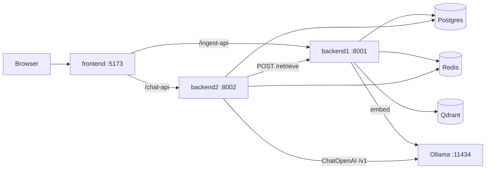

# SDNU Enterprise RAG

English: [README.en.md](./README.en.md)

多租户 RAG：FastAPI + LangChain + Qdrant，SSE 引用溯源，Ollama 同模 embedding，Compose / `start.sh` 一键演示。

演示租户 **`sdnu-demo`** · 语料 `knowledge/sdnu/`（约 **16** 篇文档）。

## 技术栈

- **Backend**: FastAPI · LangChain (LCEL) · JWT 鉴权
- **Frontend**: React · Vite · Ant Design
- **Data**: Postgres · Redis · Qdrant（集合 `sdnu_chunks`）
- **Models**: Ollama `qwen3-embedding:0.6b`（**1024-d**）· OpenAI 兼容对话（默认 `qwen2.5:1.5b`）
- **Ops**: Docker Compose · `start.sh` 本机一键启动

## 亮点

| 能力 | 具体说明 |
|------|----------|
| 服务拆分 | `backend1`（`:8001`）入库 / 检索；`backend2`（`:8002`）鉴权 / 会话 / RAG 对话；检索经 HTTP `POST /retrieve` 解耦 |
| 多租户隔离 | 受保护接口强制 `X-Tenant-Id`，须与 JWT `tenant_id` 一致；Qdrant payload 与 Postgres 行同维度隔离 |
| LangChain RAG | 检索 → 带引用生成；对话侧 LCEL 编排 |
| SSE 引用溯源 | `/api/v1/chat/stream`：`citation` → `token`* → `done`（或 `error`），回答可回溯到具体 chunk |
| 同模 Embedding | 入库与查询统一 Ollama `qwen3-embedding:0.6b`，**1024 维**，避免维度漂移 |
| LLM 热切换 | OpenAI 兼容三元组 `base_url` / `model` / `api_key`，`GET\|PUT /api/v1/llm/config` 运行时切换，无需重启 |
| 一键演示 | `docker compose up --build` 或 `./start.sh`（Postgres + Redis + Qdrant + 双后端 + 前端） |
| Ragas 评测 | `backend2/evals` + `pytest tests/test_ragas_sample.py`（离线 smoke / 可选 live Ollama） |
| 限流 fail-open | Redis 聊天限流（默认 60/min）；Redis 不可达时放行不 500；超限 → **429** |

## 架构



## 快速开始

前置：宿主机安装 [Ollama](https://ollama.com)，并 pull 模型：

```bash
ollama pull qwen3-embedding:0.6b
ollama pull qwen2.5:1.5b
```

**方式 A — Compose**

```bash
cp .env.example .env   # 设置 JWT_SECRET（backend1 / backend2 共用）
docker compose up -d --build
```

**方式 B — 本机 `start.sh`**

```bash
./start.sh          # Postgres + Qdrant（Docker）+ 本机 Redis / Ollama + 双后端 + 前端；缺语料时灌入 knowledge/sdnu
./start.sh stop
```

| 入口 | URL |
|------|-----|
| 前端 | http://127.0.0.1:5173 |
| backend1 OpenAPI | http://127.0.0.1:8001/docs |
| backend2 OpenAPI | http://127.0.0.1:8002/docs |

**首次灌库**：`./start.sh` 会按文件名补齐 `knowledge/sdnu/` 到租户 `sdnu-demo`。Compose **不会**自动入库；用 `sdnu-demo` 注册登录后在文档页上传（小 txt 建议 `sync=true`），或对 `:8001` 调 `POST /api/v1/ingest`（`Authorization` + `X-Tenant-Id: sdnu-demo`）。

## 端口与关键 API

| 服务 | 端口 | 职责 |
|------|------|------|
| frontend | `5173` | UI（`/ingest-api` → b1，`/chat-api` → b2） |
| backend1 | `8001` | `POST /ingest` · `POST /retrieve` · 文档列表 |
| backend2 | `8002` | 鉴权 · 会话 · `POST /chat` · `POST /chat/stream` · LLM 热配置 |
| Qdrant | `6333` | 向量库，集合 `sdnu_chunks` |

受保护请求头：`Authorization: Bearer <JWT>` + `X-Tenant-Id: sdnu-demo`。

## 说明

作品集 / 演示项目：公开资料风格语料 + 多租户 RAG 管线，**非**校方官方系统。校徽素材见 [frontend/public/ATTRIBUTION.md](./frontend/public/ATTRIBUTION.md)。

English: [README.en.md](./README.en.md)
